# Sprint 2 — Reponses

## Exercice 1 — Cartographie

### 1.1 Classes et interfaces publiques

- BillingService
- BookingService
- EmailSender
- HousekeepingScheduler
- FlexibleCancellationPolicy
- ModerateCancellationPolicy
- StrictCancellationPolicy
- NonRefundableCancellationPolicy
- StandardCleaningPolicy
- VipCleaningPolicy
- InMemoryReservationStore
- InMemoryRoomStore
- InvoiceGenerator
- StandardPricingStrategy
- SuitePricingStrategy
- FamilyPricingStrategy
- RoomAssigner
- SmsSender
- IReservationRepository
- IConfirmationSender
- ICleaningNotifier
- ICancellationPolicy
- IRoomRepository
- PricingStrategyFactory
- TaxCalculator
- IPricingStrategy
- Reservation
- Room
- Invoice
- InvoiceLine
- CleaningTask
- RoomType

### 1.2 Graphe de dependances

Schéma MERMAID :

```mermaid
graph TD
  BillingService --> InvoiceGenerator
  BillingService --> IReservationRepository
  BookingService --> IReservationRepository
  BookingService --> RoomAssigner
  BookingService --> IConfirmationSender
  EmailSender -.-> IConfirmationSender
  HousekeepingScheduler --> IReservationRepository
  HousekeepingScheduler --> ICleaningPolicy
  HousekeepingScheduler --> ICleaningNotifier
  FlexibleCancellationPolicy -.-> ICancellationPolicy
  ModerateCancellationPolicy -.-> ICancellationPolicy
  StrictCancellationPolicy -.-> ICancellationPolicy
  NonRefundableCancellationPolicy -.-> ICancellationPolicy
  StandardCleaningPolicy -.-> ICleaningPolicy
  VipCleaningPolicy -.-> ICleaningPolicy
  InMemoryReservationStore -.-> IReservationRepository
  InMemoryRoomStore -.-> IRoomRepository
  InvoiceGenerator --> PricingStrategyFactory
  InvoiceGenerator --> TaxCalculator
  InvoiceGenerator --> IRoomRepository
  StandardPricingStrategy -.-> IPricingStrategy
  SuitePricingStrategy -.-> IPricingStrategy
  FamilyPricingStrategy -.-> IPricingStrategy
  RoomAssigner --> IRoomRepository
  RoomAssigner --> IReservationRepository
  SmsSender -.-> ICleaningNotifier
```

### 1.3 Clusters identifies

- Cluster 1 : Réservation
  - Justification : Ces classes changent ensemble pour des raisons liées aux règles d'accueil (ex: politique d'annulation modifiée, nouvelle règle d'attribution des chambres, changement du délai de confirmation). Elles partagent la responsabilité d'accepter et de valider la venue d'un client. Selon le principe CCP, elles forment une unité logique métier indépendante du nettoyage ou de la comptabilité.
- Cluster 2 : Comptabilité
  - Justification : Ce groupe est dédié aux aspects financiers. Si la loi modifie le taux de TVA ou si la direction décide d'une nouvelle stratégie de prix pour les suites, seules ces classes seront impactées en même temps (CCP). Elles n'ont pas besoin de connaître les règles d'annulation préalables ou les plannings de ménage.
- Cluster 3 : Entretien
  - Justification : Ces classes partagent la responsabilité de l'entretien de l'hôtel. Si la fréquence de ménage passe de "tous les 3 jours" à "tous les 2 jours", le changement sera confiné à ce cluster (CCP). Ce groupe a une forte cohésion interne et ne se soucie ni des prix payés ni des annulations.

---

## Exercice 2 — Decoupage

### Modules crees

| Module | Justification |
|-------|---------------|
| **Hotel.Booking** | Gère les règles d'accueil, l'assignation de chambre et l'annulation. Isolé du reste pour ne gérer que la logique de prise de réservation. |
| **Hotel.Billing** | Regroupe la logique financière (génération de factures, calcul des taxes et application des stratégies de prix). |
| **Hotel.Housekeeping** | Centralise la gestion de l'entretien (plannings et politiques de nettoyage). Totalement autonome vis-à-vis des tarifs ou des annulations. |
| **Hotel.Infrastructure** | Contient tous les adaptateurs techniques (Base en mémoire, envois d'Email/SMS). Il traduit les entités complètes en DTOs spécifiques pour chaque module. |
| **Hotel.Runner** | Le "Composition Root" (Point d'entrée). Il orchestre et branche l'infrastructure sur les interfaces métiers sans connaître les détails internes (logique métier en `internal`). |

### Justification par principe

- **CCP** : J'ai regroupé `InvoiceGenerator` et `TaxCalculator` dans `Hotel.Billing` car un changement de législation fiscale impactera ces deux classes simultanément. Le changement sera restreint à ce seul module.
- **CRP** : J'ai séparé le gros `IReservationRepository` en interfaces spécifiques (ex: `IHousekeepingReservationRepository`). Le ménage (`Housekeeping`) ne dépend plus des logiques de création (`Add()`) de réservation dont il ne se sert pas.
- **REP** : Chaque module a une sémantique forte et regroupe un domaine cohérent. On pourrait versionner `.Billing` et le distribuer dans un package NuGet pour qu'il soit réutilisé par un autre logiciel comptable du réseau hôtelier.

---

## Exercice 3 — Test de la modification

### Scenario A — Politique de menage

- Fichiers modifies : ...
- Modules impactes : ...
- Principe en jeu : ...

### Scenario B — Taux de TVA

- Fichiers modifies : ...
- Modules impactes : ...

### Scenario C — Push notification

- Fichiers crees : ...
- Fichiers modifies : ...
- Modules metier impactes : ...
- Principe en jeu : ...

### Comparaison avec le code de depart

(Paragraphe d'analyse)
